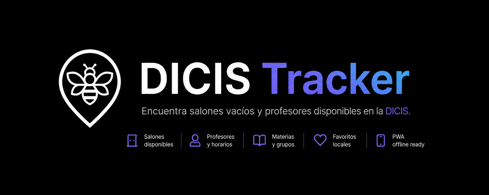

<p align="center">
  
</p>

<h1 align="center">DICIS Tracker</h1>

<p align="center">
  Encuentra salones vacíos y profesores disponibles en la DICIS.
</p>

<p align="center">
  <a href="https://github.com/moraxh/DICIS-Tracker"><strong>→ GitHub</strong></a>
</p>

<p align="center">
  
  
  
  
  
  
</p>

---

DICIS Tracker es una herramienta rápida y ligera para estudiantes de la DICIS (División de Ingenierías Campus Irapuato Salamanca de la Universidad de Guanajuato). Su objetivo es ayudar a encontrar salones vacíos, consultar horarios y saber si un profesor está disponible sin tener que navegar tablas pesadas o sistemas poco cómodos desde el celular.

> **Aviso legal:** esta no es una herramienta oficial de la Universidad de Guanajuato. La información proviene de fuentes públicas y se muestra con fines informativos.

## ¿Qué es y qué NO es este proyecto?

El proyecto nació con una meta sencilla: **ayudar a encontrar un salón vacío o saber si un profe está disponible**.

DICIS Tracker no busca ser una plataforma integral de gestión académica, registro personal de materias, historial escolar ni sustituto de sistemas oficiales. Por enfoque y por cuidado legal, se mantiene como una utilidad de consulta rápida para la comunidad estudiantil.

## Infraestructura y costos

El propósito principal de la arquitectura es mantener el proyecto **100% gratis**. Actualmente funciona apoyándose en capas gratuitas y en datos preparados estáticamente:

- **Vercel** para desplegar el frontend Next.js.
- **GitHub Actions** para automatización y validaciones.
- **SQLite + JSON exportado** para servir datos rápidos desde la app.
- **Supabase opcional** para funcionalidades ligeras que no son críticas para consultar horarios.

Por eso somos cuidadosos con rendimiento, tamaño de bundle, frecuencia de scraping y consumo de servicios externos. Cualquier PR que reduzca consultas, mejore tiempos de carga, optimice el build o mantenga la app barata de operar es muy bienvenido.

## Características

- **Salones disponibles:** consulta espacios libres según el horario actual.
- **Salones ocupados:** revisa qué materias están usando cada salón.
- **Profesores:** encuentra profesores y consulta sus horarios.
- **Materias y grupos:** explora clases, cursos y disponibilidad relacionada.
- **Favoritos locales:** guarda salones o profesores frecuentes en el navegador.
- **PWA:** app instalable con soporte offline/cache.
- **Tema claro/oscuro:** interfaz cómoda para uso diario.
- **API interna:** endpoints de lectura para profesores, salones y materias.
- **Scraper:** pipeline Python para recolectar datos públicos y generar la base local.

## Stack

```txt
frontend/
  Next.js 16 + React 19
  Tailwind CSS 4
  next-pwa
  Motion
  Supabase client opcional
  better-sqlite3
  Biome

scrapper/
  Python 3.10+
  Scrapers por fuente
  SQLite exportable
  Ruff
```

## Arquitectura

```txt
Fuentes públicas
        │
        ▼
Scraper Python
        │
        ▼
frontend/src/data.db
        │
        ▼
scripts/export-db.mjs
        │
        ├─ professors.json
        ├─ rooms.json
        ├─ subjects.json
        ├─ courses.json
        └─ classes.json
              │
              ▼
Next.js App Router
        │
        ├─ Home: favoritos, salones libres, salones ocupados
        ├─ /professors
        ├─ /rooms
        ├─ /subjects
        └─ /api/v1/*
```

## Desarrollo local

Requisitos:

- Node.js compatible con Next.js 16
- pnpm
- Python 3.10+ si vas a trabajar con el scraper

Instala dependencias del frontend:

```bash
cd frontend
pnpm install
```

Crea `frontend/.env.local` si necesitas configurar URL pública o Supabase:

```bash
NEXT_PUBLIC_APP_URL=http://localhost:3000
NEXT_PUBLIC_SUPABASE_URL=
NEXT_PUBLIC_SUPABASE_ANON_KEY=
```

Ejecuta la app:

```bash
cd frontend
pnpm dev
```

Para regenerar datos desde SQLite:

```bash
cd frontend
pnpm build
```

El `prebuild` ejecuta `scripts/export-db.mjs` y actualiza los JSON usados por la app.

## Scraper

Instala dependencias de Python:

```bash
cd scrapper
python -m venv .venv
source .venv/bin/activate
pip install -r requirements.txt
```

Ejecuta el pipeline:

```bash
python src/main.py
```

Por defecto escribe la base en `frontend/src/data.db`.

## Scripts

Desde `frontend/`:

```bash
pnpm dev      # servidor local de Next.js
pnpm build    # exporta datos y genera build de producción
pnpm start    # sirve el build de producción
pnpm lint     # biome check
pnpm format   # biome format --write
```

## Contribuir

Nos encantaría ver tus Pull Requests. Antes de meterle mano al código, lee la [Guía de Contribución](CONTRIBUTING.md) para mantener el proyecto alineado con su visión: una herramienta rápida, clara y gratuita para estudiantes.

## Contribuidores

¡Gracias a todas las personas que han aportado para mantener este proyecto!

<a href="https://github.com/moraxh/DICIS-Tracker/graphs/contributors">
  
</a>
